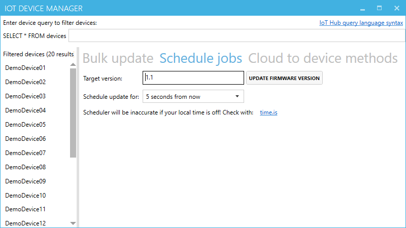

# IoT device manager

This is a **demonstration UI** for multi-device management when using [IoT Hub](https://azure.microsoft.com/services/iot-hub/). As such it only supports limited scenarios.



If you need more features, consider using [Azure IoT Explorer](https://github.com/Azure/azure-iot-explorer) (or the deprecated [DeviceExplorer](https://github.com/Azure/azure-iot-sdk-csharp/tree/master/tools/DeviceExplorer)).

# Setup instructions

All commands use the [Azure CLI](https://docs.microsoft.com/cli/azure/install-azure-cli). It is preinstalled in the [Azure Cloud shell](https://azure.microsoft.com/features/cloud-shell).

## Setup in Azure

You need to create an IoT hub instance. The Standard tier is recommended (**Basic tier will not work** as it lacks cloud to device capabilities. **Free tier might work** but you will quickly run into the daily message limit). 

Once the IoT hub exists get its iothubowner connection string in the portal via "Shared access signatures or via Azure CLI:

``` powershell
# can run either in Cloudshell or locally
az extension add --name azure-cli-iot-ext

az iot hub show-connection-string --hub-name {YourIoTHubName} --output table
```

## Local setup

### 1. Create demo devices

First add the connection string to the appsettings.json of the `BulkDeviceCreator` and then run it.

It will create demo devices in the IoT hub as per the `devices.csv` file. 

### 2. IoT device manager

Add the same connection string to the appsettings.json of `IoTDeviceManager` to allow it to manage the IoT hub.

You should be able to run it and see a list of all devices. Enter a query like `WHERE tags.country = 'US'` and the list of devices should be filtered to only show those with the tags (see the `devices.csv` for device tags such as `country`, `building`, `floor`,.. ).

### 3. IoTClient.Cli

You can enter one or multiple connection strings and the client will simulate all those devices at once.

For every device it will listen to cloud to device messages and property updates as well as continuously send sensor data into IoT hub.

Run this powershell command to get connectionstrings from all devices in the IoT hub (you must be authenticated in az cli):

First set the name of your IoT hub:
``` powershell
$hubName = "{YourIoTHubName}"
```
Then run this command to get all connectionstrings (it will take a few minutes):
``` powershell
$count = 20; if (!$hubName) { throw "Must set `$hubName first!";} $connectionStrings = @(); 1..$count | foreach { Write-Host "Getting connectionstring for device $_/$count"; $connectionStrings += ((az iot hub device-identity show-connection-string --hub-name homeapp --device-id ("DemoDevice{0:d2}" -f $_) --output json) | ConvertFrom-Json).connectionString }; Write-Output $connectionStrings
```

You can paste the output into the appsettings.json **inside Visual Studio** (Visual Studio will automatically format it to have correct json encoding).

``` json
{
    "ConnectionStrings": {
        "DeviceConnections": [
            // paste connectionstrings here
        ]
    }
}
```

# Running it

After setting up all devices with the bulk creator you can now run `IoTClient.Cli` and `IotDeviceManager` in parallel.

The client will send random telemetry to the IoT Hub and receive messages sent from the IoTDeviceManager.

# Example instructions

Here are example usescases that can be demonstrated with the client.

## Update all devices in a building at night

> Usecase: Rolling out updates in stages is a common practice. For IoT devices it might make sense to roll out updates to a building at night when nobody is using them.

In the IoT device manager enter a query like `WHERE tags.country = 'US' and tags.building = 'Building 7'` (it should filter to the first 5 devices).

Then switch to the `Schedule jobs` tab and press the update button to simulate a firware update (it will be scheduled 5 seconds from, so let's pretend it's night time in Building 7).

The client should now receive those update messages for the selected 5 devices and process them.

## Update desired properties for many devices (device twin)

> Usecase: Configuration should be easy. With IoT hubs device twin model it is possible to set a desired state in the cloud and devices will reflect the changes as soon as they are connected.

In the IoT device manager enter a query like `WHERE NOT is_defined(properties.reported.overheatThreshold)` (it should filter to all devices as no device has an overheat threshold set by default).

Then configure a value and press set threshold.

All affected devices should acknowledge and future sensor values will contain a property `overheated` when the sensor value is too high.
